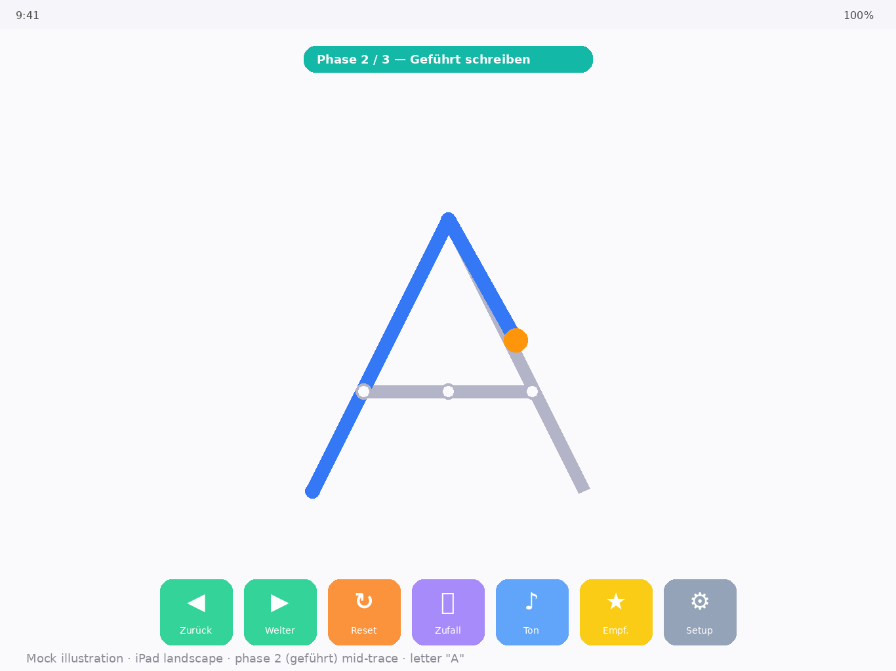
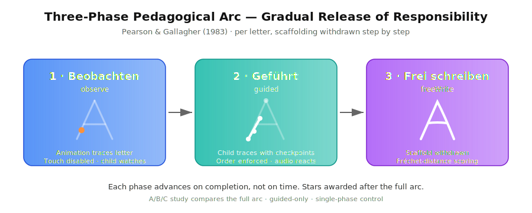
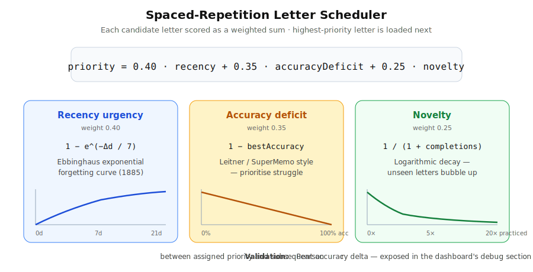
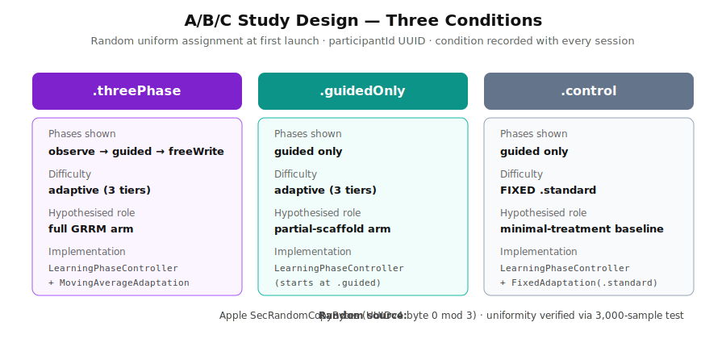
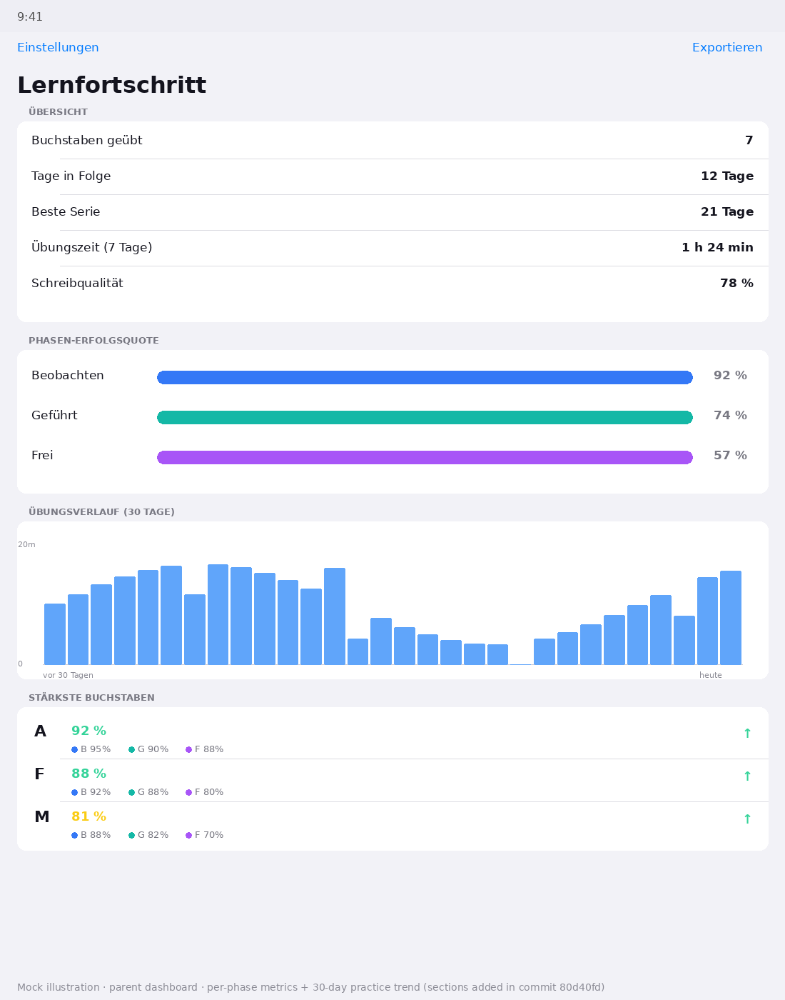

# Buchstaben-Lernen-App — App Overview & Reference

A single source-of-truth document for the app, written so that individual sections can be lifted directly into App Store copy, parent / teacher demos, or thesis defence material. Marketing-facing language is kept on the left of each section; the scientific lens is broken out explicitly so it can be cited or adapted.

---

## Executive summary

**Marketing.** *Buchstaben-Lernen-App* (working title: "Letter-Learning App") is an iPad app that teaches German-speaking children, ages 5–6, to write the alphabet by tracing letters with a finger or Apple Pencil. The app turns each letter into a guided-then-independent practice session, gives audio and haptic feedback in real time, and quietly adapts what the child sees next based on how they're doing. Designed for use at home or in a classroom, fully offline, no accounts, no ads.

**Scientific.** The app implements a **gradual-release-of-responsibility (GRRM) three-phase learning model** (Pearson & Gallagher, 1983) for handwriting acquisition, with **adaptive scaffolding withdrawal** across the *observe → guided → free-write* arc. Stroke accuracy is measured per phase via checkpoint proximity and (for the free-write phase) **discrete Fréchet distance** (Eiter & Mannila, 1994) between the child's path and the canonical glyph centerline. Letter selection is driven by a lightweight **Ebbinghaus-style spaced-repetition scheduler**. The app is instrumented for a **between-subjects A/B/C study** comparing the full GRRM arc against guided-only and a single-phase control, with all research data exportable as CSV/JSON for analysis in R or Python.

---

## 1 · Marketing lens

### 1.1 What the app does
A child opens the app and sees a single big letter with three faded stroke lines. A small dot moves along each stroke to show the writing order. When the child is ready, they trace over the lines. The app plays the letter's sound while they trace; the sound speeds up or slows down with the child's tracing speed. Stars appear when the letter is complete. The next letter is chosen automatically based on which letters need more practice.


*Mock illustration of the guided-phase tracing canvas: child is mid-stroke on the right leg of "A"; the orange dot marks where to head next; checkpoints for the unwritten crossbar are still empty.*

### 1.2 Who it's for
- German-speaking children, ages 5–6, learning to write
- Used at home (parent supervision optional) or in a classroom (kindergarten / first grade)
- Designed for typically-developing children — assistive input modes are not in scope

### 1.3 Key features at a glance
- **Three-step pedagogical arc per letter** — *watch the demo, trace with guides, write freely* — never just "trace and you're done."
- **Audio that responds to the child's hand** — German letter pronunciation slows down when the child traces slowly and speeds up as they accelerate, so the sound is coupled to the motor act.
- **Haptic feedback** — gentle taps on every checkpoint and a stronger tap when a stroke or whole letter is finished. Reinforces the rhythm of writing without being distracting.
- **Smart letter selection** — the next letter to practice is chosen automatically, prioritizing the ones the child either hasn't seen recently, struggles with, or has practiced least.
- **Difficulty that adjusts itself** — three difficulty tiers (easy / standard / strict) widen or tighten how forgiving the trace check is, based on the child's recent accuracy. No settings menu for the child.
- **Parent dashboard** — per-letter accuracy, per-phase scores, daily practice trend over 30 days, streak counter. One tap to export everything as CSV or JSON.
- **Four German handwriting fonts** — *Druckschrift* (default), *Grundschrift*, *Vereinfachte Ausgangsschrift*, *Schulausgangsschrift*. Parent picks once in Settings.
- **Fully offline, no accounts, no ads** — every byte of data stays on the device.

### 1.4 Pedagogical approach in plain language
Children learn to write best when they first **watch** how a letter is formed, then **practice with help**, then **write on their own** — and when each step releases more responsibility to them. This three-step pattern is well-established in literacy research as the *Gradual Release of Responsibility Model*. The app builds the arc into every single letter.

It also leans on two other findings: that **practice spaced over time** beats massed practice (Ebbinghaus, 1885; Cepeda et al., 2006), and that **rewards tied to genuine progress** are healthier for motivation than constant praise (Self-Determination Theory; Deci & Ryan, 2000). The star celebration only triggers when the child has actually completed a phase session.

### 1.5 Privacy
- **No network calls.** The app does not open a single socket. Verified via the Privacy Manifest declaration (`PrivacyInfo.xcprivacy` lists only `UserDefaults`).
- **No PII collected.** The only persistent identifier is a **pseudonymous UUID** generated locally on first launch and used only to label exported research data.
- **No analytics or third-party SDKs.** Zero external dependencies in the package manifest.
- **Data sandboxed to the device.** Learning progress, calibration, and dashboard data are stored in the iOS app's Application Support directory, protected by iOS's standard file-protection class.
- **Export is parent-initiated.** Data leaves the device only when a parent taps "Export" and chooses where the file goes via the iOS share sheet.

### 1.6 Differentiators
Compared to the typical alphabet-learning app on the App Store:
- Most alphabet apps are *trace-once-and-celebrate*. This one is built around an evidence-based three-phase arc.
- Most have audio that plays a fixed recording when the letter is tapped. This one ties the audio's *speed* to the child's *tracing velocity* in real time, so the child hears their own pace.
- Most either show no parent data or send everything to a cloud dashboard. This one gives the parent a rich offline dashboard and lets them export the raw data if they want it (e.g. for a teacher).
- Most are localised English apps with a *de* lacquer. This one is German-first: text, fonts, and pedagogical conventions match the German *Schulausgangsschrift* tradition.

---

## 2 · Scientific lens

### 2.1 Theoretical grounding

| Construct | Source | Where in the app |
|---|---|---|
| Gradual Release of Responsibility (three-phase model) | Pearson & Gallagher (1983) | `LearningPhaseController.swift`, three-condition study design |
| Ebbinghaus forgetting curve (exponential recency decay) | Ebbinghaus (1885); Cepeda et al. (2006) meta-analysis | `LetterScheduler.swift` recency component (`1 − e^(−daysSince/7)`) |
| Discrete Fréchet distance | Eiter & Mannila (1994) | `FreeWriteScorer.swift` — free-write phase scoring |
| Self-Determination Theory (intrinsic motivation, contingent reward) | Deci & Ryan (2000) | Phase-contingent star celebration; rewards tied to phase completion only |
| WCAG 2.1 AA contrast | W3C | Letter picker palette (audited at 4.7:1) |

### 2.2 Pedagogical model — implementation detail



The `LearningPhaseController` exposes three phases per letter session, each with explicit behavioural gates:

| Phase | Touch enabled | Show start dots | Checkpoint gating | What the child sees |
|---|---|---|---|---|
| **observe** | no | yes | no | Animated dot traces each stroke; child watches |
| **guided** | yes | yes | yes (must hit checkpoints in order) | Child traces with full scaffold; out-of-order strokes don't progress |
| **freeWrite** | yes | no | no | Scaffold withdrawn; child writes freely; scored by Fréchet distance |

Phase transitions are not time-gated — they advance on completion (observe: after N animation cycles; guided: when all checkpoints hit; freeWrite: on lift after meeting min path length).

Three letters with full glyph data are currently calibrated for the full arc: **A, F, I, K, L, M, O** (seven letters). Other letters fall back to a single-vertical-line stroke definition; documented as a scope limitation.

### 2.3 Algorithmic core

#### Stroke tracking (`StrokeTracker.swift`)
Per-stroke checkpoint proximity. Each stroke is a polyline of normalized (0–1) checkpoint coordinates. A touch is "near a stroke" when its normalized position is within `checkpointRadius × radiusMultiplier` of the next-expected checkpoint. Difficulty tiers manipulate `radiusMultiplier`.

#### Audio adaptation (`AudioEngine.swift`)
`AVAudioEngine` + `AVAudioUnitTimePitch` chain. Tracing velocity is mapped (monotonic, bounded) onto playback rate via `mapVelocityToSpeed`; horizontal pencil bias modulates the rate slightly to simulate left/right-handed asymmetry. Audio is gated by a state-machine (`PlaybackStateMachine.swift`) that blocks playback when the app is backgrounded or the child has lifted their finger.

#### Difficulty adaptation (`DifficultyAdaptation.swift`)
Three tiers — `.easy`, `.standard`, `.strict` — corresponding to checkpoint-radius multipliers of 1.5×, 1.0×, 0.7×. The `MovingAverageAdaptationPolicy` uses an exponentially-weighted moving average over the last N completion accuracies to escalate or de-escalate. The `FixedAdaptationPolicy` (used for the **control** condition in the A/B study) pins the tier at `.standard` to remove adaptive scaffolding as a confound.

#### Spaced-repetition scheduler (`LetterScheduler.swift`)



Selects the next letter via a weighted score:
```
priority = recencyUrgency × 0.40
         + accuracyDeficit × 0.35
         + novelty × 0.25
```
where:
- `recencyUrgency = 1 − exp(−daysSinceLast / 7)` (Ebbinghaus exponential)
- `accuracyDeficit = 1 − bestAccuracy` (Leitner / SuperMemo style)
- `novelty = 1 / (1 + completionCount)` (logarithmic decay)

A `schedulerEffectivenessProxy` is computed on the dashboard as the **Pearson correlation** between assigned priority and subsequent accuracy delta — positive values indicate the scheduler is correctly prioritising struggling letters.

#### Free-write scoring (`FreeWriteScorer.swift`)
Implements the canonical recurrence from Eiter & Mannila (1994):
```
dF(i, j) = max( d(P_i, Q_j),
                min( dF(i−1, j),
                     dF(i−1, j−1),
                     dF(i, j−1) ) )
```
with explicit base cases for empty and degenerate paths. Returns a similarity score in [0, 1] used as the free-write phase's primary outcome variable.

### 2.4 A/B/C research design



| Condition | Code | Behaviour |
|---|---|---|
| Three-phase | `.threePhase` | Full GRRM arc: observe → guided → freeWrite. Adaptive difficulty enabled. |
| Guided only | `.guidedOnly` | Skips observe and freeWrite; child only sees the guided phase. Adaptive difficulty enabled. |
| Control | `.control` | Single-phase guided practice with **fixed** difficulty (`.standard`). Closest to a typical commercial alphabet app. |

**Random assignment** is performed once at first launch in `ThesisCondition.assign(participantId:)` by indexing the first byte of the participant's UUIDv4 modulo 3. UUIDv4's first byte is uniformly distributed (random source: Apple's `SecRandomCopyBytes`), so the assignment is uniform; verified by a 3,000-sample test (`ThesisConditionAssignmentTests`).

The participant ID is persisted to `UserDefaults` under the key `de.flamingistan.buchstaben.participantId`; the assigned condition is recorded with **every** session (`PhaseSessionRecord.condition`, `SessionDurationRecord.condition`) so post-hoc analysis can reconstruct the per-arm dataset directly from the export.

### 2.5 Data captured & exported


*Mock illustration of the parent dashboard with the per-phase Erfolgsquote section, 30-day Übungsverlauf chart, and per-letter rows showing the Beobachten / Geführt / Frei breakdown.*

Captured per-session in the `JSONParentDashboardStore` (`Application Support/BuchstabenNative/dashboard.json`):

| Field | Type | Source |
|---|---|---|
| `letter` | String | Currently traced letter |
| `phase` | String (`observe` / `guided` / `freeWrite`) | `LearningPhaseController.currentPhase` |
| `completed` | Bool | Whether the phase reached its completion criterion |
| `score` | Double in [0, 1] | Phase-specific accuracy (checkpoint hit rate or Fréchet similarity) |
| `schedulerPriority` | Double | The priority the scheduler assigned this letter when it was chosen |
| `condition` | ThesisCondition | A/B/C arm at session time |
| `dateString` | "YYYY-MM-DD" | Session date in user's calendar |
| `durationSeconds` | TimeInterval | Total time on the letter |

**Exported** by `ParentDashboardExporter.swift` as either:
- **CSV**: header line `# participantId=<UUID>`, then rows for letter stats, session durations, and per-phase records (each with `condition` column for arm-stratified analysis)
- **JSON**: full `DashboardSnapshot` plus pseudonymous `participantId`

Derived metrics computed on `DashboardSnapshot` and visible in the dashboard UI (some debug-only):
- `phaseCompletionRates: [String: Double]` — fraction of started phase sessions that completed, per phase
- `averageFreeWriteScore: Double` — mean Fréchet score across completed free-write sessions
- `phaseScores(for: letter)` — per-phase mean scores for one letter
- `dailyPracticeMinutes(days:)` — zero-filled daily practice trend
- `schedulerEffectivenessProxy: Double` — Pearson `r` between priority and subsequent accuracy delta (debug-only metric for thesis validation)

### 2.6 Analyses the data supports

A non-exhaustive list of analyses the exported data is sized to support:

1. **Phase mastery comparison across conditions** — does the threePhase arm produce higher per-letter `freeWrite` scores than the guidedOnly arm? Independent-samples test stratified by `condition` column.
2. **Learning-curve fit** — does per-letter accuracy follow a power-law / exponential decay over completion count? Per-letter regression on `accuracySamples`.
3. **Spacing-effect verification** — does practice spread across more days produce better retention than concentrated practice? Linear model on `accuracy ~ uniqueDayCount + totalSessions` per letter.
4. **Scheduler validation** — does `schedulerEffectivenessProxy` differ from zero in expected direction? One-sample t-test on the per-participant Pearson r values.
5. **Frustration / drop-off rate** — what fraction of phase sessions are *started but not completed* across conditions? Proxy for cognitive overload.
6. **Time-on-task per letter** — practice budget allocation: which letters dominate the child's session?

### 2.7 Limitations & scope (be honest in the thesis)

- **Calibrated letter set is partial**: A, F, I, K, L, M, O have hand-calibrated stroke checkpoints; other letters fall back to a single-vertical-line geometry that the GRRM arc still operates on but with weaker pedagogical fidelity.
- **Single-device data only**: no CloudKit / multi-device sync. A child practicing on two iPads would generate two separate participantIds.
- **Typically-developing children focus**: assistive input (Switch Control, AssistiveTouch) is functional via standard iOS but not specifically designed for. Out of scope per `PROJECT.md`.
- **iOS 26+ only**: deployment target is iOS 26.0; the install base on family iPads is narrower than for an app on iOS 18+.
- **Single-letter free-write**: the free-write phase scores a single letter trace, not freely-composed words or sentences. Generalisation to handwriting *fluency* is not directly measured.
- **No teacher dashboard**: the parent dashboard is per-device; a teacher with a class of 25 children would need to collect 25 exports manually.

### 2.8 References
- Pearson, P. D., & Gallagher, M. C. (1983). *The instruction of reading comprehension.* Contemporary Educational Psychology, 8(3), 317–344.
- Ebbinghaus, H. (1885). *Über das Gedächtnis: Untersuchungen zur experimentellen Psychologie.* Duncker & Humblot.
- Cepeda, N. J., Pashler, H., Vul, E., Wixted, J. T., & Rohrer, D. (2006). *Distributed practice in verbal recall tasks: A review and quantitative synthesis.* Psychological Bulletin, 132(3), 354–380.
- Eiter, T., & Mannila, H. (1994). *Computing discrete Fréchet distance.* Tech Report CD-TR 94/64, Technische Universität Wien.
- Deci, E. L., & Ryan, R. M. (2000). *The "what" and "why" of goal pursuits: Human needs and the self-determination of behavior.* Psychological Inquiry, 11(4), 227–268.
- W3C (2018). *Web Content Accessibility Guidelines (WCAG) 2.1.* W3C Recommendation.

---

## 3 · Technical architecture (shared)

### 3.1 Stack
- **Language:** Swift 6.3 with strict concurrency (`-default-isolation MainActor`)
- **UI:** SwiftUI (iOS 18+ APIs, e.g. `Charts`, `@Observable`, scene-phase observers)
- **Audio:** `AVAudioEngine` + `AVAudioUnitTimePitch` (real-time time-stretch, no pre-recorded variants)
- **Haptics:** `CoreHaptics` (with `UIKit` haptic fallback for low-end devices)
- **Persistence:** Plain JSON files in `Application Support/`, atomic writes, async write coalescing
- **Build:** Swift Package Manager; Xcode 26.4 host project for the app target
- **Dependencies:** **zero** external packages

### 3.2 Module layout
```
BuchstabenNative/                  Swift Package (the entire app's behaviour)
├── App/                           App entry + root view
├── Core/                          Pure-logic types: stores, scheduler, scoring,
│                                  audio engine, haptic engine, pedagogy, A/B,
│                                  privacy manifest backing models
└── Features/
    ├── Library/                   Letter loading + bundle/cache
    ├── Tracing/                   View model, canvas, controllers,
    │                              dependency container, calibration overlay
    ├── Onboarding/                Five-step first-launch flow
    └── Dashboard/                 Parent dashboard + settings + per-phase views

BuchstabenApp/                     Xcode host target (re-exports the package)
BuchstabenNativeTests/             Swift Testing suite (~480 tests across ~30 files)
scripts/                           AppIcon generator, PBM/stroke utilities
docs/                              This file + future supplementary docs
```

### 3.3 Dependency injection
A single `TracingDependencies` struct passes every external collaborator into `TracingViewModel`. Production uses `.live` defaults; tests use a `.stub` fully-mocked variant. Four controllers extracted from the view model — `PlaybackController`, `TransientMessagePresenter`, `AnimationGuideController`, `CalibrationStore` — plus the `LetterScheduler` are exposed as factory closures so per-test customisation (instant timers, fixed letters) is one line of setup.

### 3.4 Persistence durability
All four JSON stores (`ProgressStore`, `StreakStore`, `ParentDashboardStore`, `OnboardingStore`) follow the same pattern:
1. Synchronous in-memory state update (UI is immediately consistent)
2. Background `Task.detached(priority: .utility)` chain that serialises and atomically writes the file
3. Public `flush() async` method that awaits the chain
4. `TracingViewModel.appDidEnterBackground()` is `async` and awaits `flush()` on every store before returning — guaranteed durability across the iOS scene-suspension grace window.

### 3.5 Build & test infrastructure
- CI: GitHub Actions on `macos-26-arm64` runners with Xcode 26.4
- Two CI legs: hosted iPad simulator + a self-hosted MacBook for device-class verification
- `swift build` works on Linux for syntax / pure-logic compile (SwiftUI/UIKit gracefully skipped via per-file conditionals); useful for the autocoder council loop

---

## 4 · Roadmap & current state

| Status | Item |
|---|---|
| ✅ Shipped | Tracing canvas with 7 calibrated letters (A, F, I, K, L, M, O) |
| ✅ Shipped | Three-phase GRRM model + thesis A/B/C condition assignment |
| ✅ Shipped | Adaptive difficulty (3 tiers, moving-average policy) |
| ✅ Shipped | Spaced-repetition scheduler with Ebbinghaus recency |
| ✅ Shipped | Free-write Fréchet-distance scoring |
| ✅ Shipped | Real-time audio rate adaptation, haptic feedback |
| ✅ Shipped | Onboarding flow (welcome → trace demo → first trace → reward intro) |
| ✅ Shipped | Parent dashboard (per-letter, per-phase, 30-day trend, debug research metrics) |
| ✅ Shipped | CSV / JSON export with participantId + condition |
| ✅ Shipped | Privacy manifest (`UserDefaults` only), no network calls, no analytics |
| ✅ Shipped | Four German handwriting fonts (Druck, Grund, VA, SAS) |
| ✅ Shipped | Daily practice notification + streak tracking |
| ✅ Shipped | App Icon (placeholder; see "Open" below) |
| 🟠 Almost done | CloudKit sync — see §5.1 |
| 🟡 Open | Designer pass on the AppIcon for App Store submission |
| 🟡 Open | Calibrated stroke data for the remaining 19 alphabet letters |
| 🟡 Future | Letter-name pronunciation library (separate from tracing audio) — §5.2 |
| 🟡 Future | "Free letter writing" — multi-letter word composition — §5.3 |
| 🟡 Future | Teacher / classroom dashboard — §5.4 |
| 🟡 Future | Stroke recognizer rewrite — §5.5 |
| 🟡 Out of scope (per `PROJECT.md`) | Switch Control / AssistiveTouch primary input |

CI: green on `main` (current tip: `80d40fd`).

---

## 5 · Future functionality

The roadmap above is intentionally split into "shipped", "almost done", "future" and "out of scope". This section expands each future item into what's already in the codebase, what would need to land, and the rough thesis / product value.

### 5.1 🟠 CloudKit sync — *almost done*

**Already in the repo:**
- `BuchstabenNative/Core/CloudSyncService.swift` defines a `CloudSyncService` protocol (`push`, `fetch`, `syncState`) plus the `SyncCoordinator` that orchestrates store-by-store sync.
- A `NullSyncService` (no-op) is the production default — used by `TracingDependencies` so the app ships fully functional offline today.
- A `CloudKitSyncService` class is conditionally compiled behind `#if canImport(CloudKit)` — the wiring is there, just unused.
- Test coverage: `CloudSyncServiceTests.swift` exercises the Null path.

**What's left to ship it:**
1. Flip `TracingDependencies.syncCoordinator` to construct `CloudKitSyncService` instead of `NullSyncService` when iCloud is available.
2. Add an Onboarding step that asks the parent to opt in to iCloud sync (with a genuine "no" path that keeps NullSyncService).
3. Configure the iCloud container in Xcode + provisioning, add the `iCloud` capability.
4. Conflict-resolution policy: last-write-wins by `lastSyncedAt` is the simplest correct option for per-device learning data; document it.

**Value:**
- A child practising on family iPad and grandparent's iPad keeps one continuous learning trajectory.
- For thesis: lets one participant generate consistent data across multiple devices without the participantId fragmenting.

### 5.2 🟡 Letter-name pronunciation library

**Status:** referenced in earlier architecture notes but currently absent — the present `AudioEngine` plays the audio file associated with each letter (multiple variants per letter live in `BuchstabenApp/Letters/<L>/`). A separate pronunciation library would be useful for:

- Phase-specific announcements ("Das ist ein A" before the trace starts)
- Onboarding voice-overs that aren't tied to a tracing gesture
- Accessibility: announce the letter name on focus

**What it would add:** a small `LetterSoundLibrary` (AVAudioPlayer-based, separate from the time-stretching `AudioEngine` chain) for short fixed-pitch playback. ~80 lines + an audio asset folder per letter.

### 5.3 🟡 "Free letter writing" — multi-letter word composition

This is the future feature that's *referenced in spirit* by the GRRM arc but not yet built. The current `freeWrite` phase scores **a single letter traced from memory**. The natural next step in the pedagogy literature is **composition**: writing a real word ("MAMA", "PAPA", first name) where the letters are already mastered individually.

**Pedagogical motivation:** transfer-of-skill is the bottleneck in early-literacy interventions — children who trace single letters perfectly often struggle when asked to compose. Measuring composition-level performance separately (and on its own learning curve) would give the thesis an outcome variable closer to functional handwriting than per-letter accuracy.

**What it would need:**
1. New `LearningPhase.compose` case (or a separate top-level `CompositionSession`) that targets a word, not a letter.
2. Word-level Fréchet scoring per letter + a connection-quality heuristic (do consecutive letters touch / overlap acceptably?).
3. UI: word prompt at top, scrollable canvas wide enough for 3–6 letters, per-letter completion state.
4. Calibrated stroke geometry for the remaining alphabet (especially M, A, P, lowercase variants — extends §4 "Calibrated stroke data" item).
5. A new dashboard section "Worterkennung" (word recognition) with composition-specific metrics.
6. Either extend the A/B/C study to add a 4th arm `.composition`, or run as a separate follow-up study with its own pre-registration.

**Estimated scope:** medium-large. ~1 week of focused dev for the minimum viable version (one word prompt, basic per-letter scoring, no calibration extension), much longer for a thesis-quality build.

### 5.4 🟡 Teacher / classroom dashboard

**Status:** not started. The current parent dashboard is per-device. A kindergarten teacher with 25 children would need to collect 25 individual exports — viable for a small thesis study but painful as a product feature.

**Two paths:**
- **Lightweight:** a "Klassenmodus" that lets multiple participantIds live on one device, switched via a teacher-only PIN screen. Each child gets their own dashboard slice. No backend.
- **Full:** CloudKit-shared aggregation (depends on §5.1 landing first); teacher Apple ID receives anonymised dashboard rollups across all enrolled children.

The lightweight path is consistent with the offline-first / no-backend stance in `PROJECT.md` and is probably the right next step.

### 5.5 🟡 Stroke recognizer rewrite

**Status:** an alternative `StrokeRecognizer` design (protocol-based with an `EuclideanStrokeRecognizer` and a session abstraction) was scaffolded earlier but removed from the codebase. The production stroke matcher is `StrokeTracker` (proximity-based, O(1) per touch event, well-tested).

**Why revisit:** if the composition feature in §5.3 lands, scoring needs to identify *which letter* the child wrote, not just *how close to the target stroke checkpoints* they came. That's a harder problem (intent recognition vs. proximity tracking) and the existing tracker isn't shaped for it. A protocol-based recognizer with pluggable matching strategies (Euclidean / Hausdorff / DTW) would let the composition path swap in a recognition strategy without the per-letter tracking path changing.

### 5.6 🟡 Calibrated stroke data for the remaining 19 letters

**Status:** A, F, I, K, L, M, O have hand-calibrated checkpoint data + glyph geometry in `LetterGuideGeometry`. The other 19 letters fall back to a single-vertical-line stroke definition that the GRRM arc still operates on but with much weaker pedagogical fidelity.

**What it takes:** for each letter, capture the canonical stroke order and direction from a reference (e.g. *Schulausgangsschrift* lehrwerk), digitise the stroke centerlines as ~5–10 normalized checkpoints per stroke, validate visually against the rendered glyph, and add an entry to both `LetterGuideGeometry.guides` and the per-letter `strokes.json`. The existing `StrokeCalibrationOverlay` (debug-only) makes this iterable on-device.

**Effort:** ~30 min per letter for someone who knows the convention; 19 × 30 min ≈ 1 working day. The biggest cost is the convention research (German states use different cursive traditions).

### 5.7 Out-of-scope reminders (per `PROJECT.md`)

For completeness, the following were explicitly deferred and are NOT future features unless the constraints in `PROJECT.md` change:

- Switch Control / AssistiveTouch as primary input (the canvas works with them via standard iOS, but isn't designed around them).
- Backend / server-mediated multiplayer or cloud-database features.
- Adaptive-difficulty algorithms beyond the current moving-average policy.
- Voice-over guidance beyond standard iOS accessibility labels.

---

## 6 · Appendices

### 6.1 The three thesis conditions in one table

| | `.threePhase` | `.guidedOnly` | `.control` |
|---|---|---|---|
| Phases shown | observe → guided → freeWrite | guided | guided |
| Adaptive difficulty | yes | yes | no (fixed `.standard`) |
| Star celebration | yes | yes | yes |
| Spaced repetition | yes | yes | yes |
| Audio rate adaptation | yes | yes | yes |
| Hypothesised role | full GRRM arm | partial-scaffold arm | minimal-treatment baseline |

### 6.2 Onboarding flow (German UI text)

1. **Welcome** — "Willkommen! Lerne Buchstaben zu schreiben" + "Los geht's!"
2. **Trace demo** — "Erst gucken / Schau, wie der Buchstabe geschrieben wird!" with animated stroke replay
3. **First trace** — "Jetzt nachmalen / Tippe die blauen Punkte" with first child-driven trace
4. **Reward intro** — "Sammle Sterne! Für jeden Buchstaben bekommst du bis zu 3 Sterne!"
5. **Complete** — proceeds into the main app

Long-press on the progress bar lets a parent skip onboarding.

### 6.3 German handwriting fonts available
- *Druckschrift* — print, default
- *Grundschrift* — slightly-connected basic script (used in many German states from grade 1)
- *Vereinfachte Ausgangsschrift* — simplified cursive (Bavaria, Saxony, etc.)
- *Schulausgangsschrift* — DDR-tradition cursive (Brandenburg, Mecklenburg-Vorpommern)

Selection persists in `UserDefaults` under `de.flamingistan.buchstaben.selectedSchriftArt`.

### 6.4 Files of interest for the thesis
- `BuchstabenNative/Core/LearningPhaseController.swift` — three-phase GRRM model
- `BuchstabenNative/Core/ThesisCondition.swift` — A/B/C condition assignment
- `BuchstabenNative/Core/LetterScheduler.swift` — Ebbinghaus-style spacing
- `BuchstabenNative/Core/FreeWriteScorer.swift` — discrete Fréchet implementation
- `BuchstabenNative/Core/ParentDashboardStore.swift` — captured data model
- `BuchstabenNative/Core/ParentDashboardExporter.swift` — CSV / JSON export
- `BuchstabenNative/Features/Tracing/TracingDependencies.swift` — dependency container (test-injectable everywhere)
- `BuchstabenNativeTests/ThesisConditionAssignmentTests.swift` — uniform-distribution evidence for the random assignment

### 6.5 What this document is not
- Not a user manual — that's the in-app onboarding flow.
- Not a developer onboarding doc — that's `APP_REFERENCE.md` + `LESSONS.md` (sibling files in this directory).
- Not the thesis itself — this is source material; the thesis would build a coherent narrative from it, refine the framing, and add the empirical results once the study runs.
